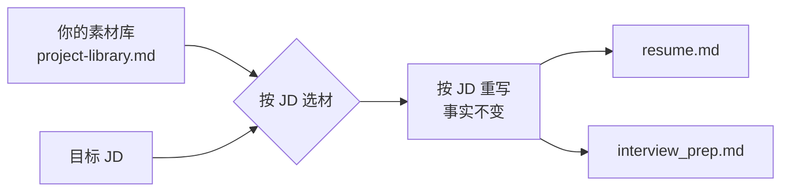

# resume-pilot 简历定制器

**把你的真实经历，按目标岗位重新组装成一份更匹配的简历 —— 素材沉淀一次，投多个岗位。**

运行在 AI coding agent（Pi / Claude Code / Codex 等）里的技能包：给它**目标公司 + 岗位 JD**，产出这份岗位专属的 **Markdown 简历**与**面试准备材料**。它**只重写表达，不编造经历** —— 素材里没有的经历，它不会替你写。

- 想先看产出长什么样 → [效果示例](#效果示例)
- 想直接跑起来 → [快速开始](#快速开始)
- 想判断适不适合自己 → [能力与边界](#能力与边界)

---

## 效果示例

**输入**：目标公司 + 一段 JD（节选）

> **电商产品经理 · 某电商公司**
> 负责导购链路转化优化、活动策略设计，协同设计/研发/运营推进落地……

**产出**：`output/<公司>/<岗位>/` 下两个文件（下列数据均为虚构示例）

`resume.md` 节选：

```markdown
# 张三
- 13800000000
- zhangsan@example.com
- 6年工作经验

**求职意向**：电商产品经理

## 核心优势

**商业化增长力**：主导从需求对接到流量分发再到转化闭环的变现路径设计，推动累计营收超1500万。

## 工作经历

**2022.03 - 至今　　　　　　　　　　　　　　　产品经理　　　　　　　　　　　　　　　甲公司**

**▶ 项目一：核心转化链路优化**

- 主导核心链路重构：以漏斗分析逐层定位流失节点，重构关键入口与引导路径，转化率提升35%。
- 主导用户分层策略：按行为特征构建分层模型并分批实验验证，活动转化率提升约一倍。
```

`interview_prep.md` 目录节选：

```
1. 岗位适配度与差距应对
2. 人设与自我介绍（1 / 2 / 3 分钟三版）
3. 项目问答（四层追问预判 + 参考答法）
4. 个人向问答（职业状态 / 离职原因 / 规划 / 优劣势）
5. JD 关键词翻译表 + 反问清单
6. 公司调研摘要（逐条标注来源）
```

---

## 它为什么不一样

常见做法是在**一份旧简历上换措辞**。这里的判断不同：**不同岗位真正需要的是不同的项目组合，这是"选材"问题，不是"措辞"问题** —— 所以核心是「选择优于优化」。

把简历拆成「素材库 + 组装规则」：素材沉淀一次、反复复用，而每份 JD 都重新选材并重写措辞。



关键约束：**事实不变，只调叙事角度** —— 数据真实归属、不夸大、不虚构（"协助"不写成"主导"）。

---

## 快速开始

### 最短路径

```bash
# 1. 安装 skill（装到 ~/.agents/skills/，多 agent 通用）
npx skills add zhe97396-tech/resume-pilot -g -y --agent '*'

# 2. 初始化（查环境 → 装依赖 → 从模板生成数据文件 → 装 git 钩子）
python scripts/setup.py

# 3. 填入真实信息（两份文件，模板自带注释）
#    ~/.resume-pilot/config/profile.yml            基本信息 / 职业经历 / 项目分组 / 优势维度 / 工具栈
#    ~/.resume-pilot/references/project-library.md 你的真实项目素材
```

然后直接对 agent 说话：

> 帮我根据这个 JD 定制简历
> 目标公司：XX公司
> JD：{粘贴完整 JD}

数据放在哪：`python scripts/check-data.py --where`。

### 安装方式选哪种

| 方式 | 命令 | 数据位置 | 适合谁 |
|---|---|---|---|
| **A. 装成 skill**（推荐） | `npx skills add zhe97396-tech/resume-pilot -g -y --agent '*'` | `~/.resume-pilot/` | 多 agent 通用；只想用，不想改代码 |
| **B. 克隆为项目** | `git clone https://github.com/zhe97396-tech/resume-pilot.git` | 项目目录内（已被 `.gitignore` 保护） | 想改规则 / 深度使用编辑器 |

<details>
<summary>为什么方式 A 的数据不在 skill 目录里？</summary>

`skills update` 会 `rm -rf` 整个 skill 目录后重装（skills CLI 的 `cleanAndCreateDirectory`），数据放在里面**必然丢失**。因此脚本一律通过 `scripts/paths.py` 定位数据目录，你无需手工配置；也**不要**把数据手工放回 skill 目录。
</details>

<details>
<summary><code>setup.py</code> 装的 git 钩子做什么？</summary>

提交前自动校验数据完整性，防止把「被示例内容覆盖的数据」误提交（真实事故防护）。不需要时用 `git commit --no-verify` 绕过。
</details>

### 两种调用方式（等效）

| 方式 | 用法 | 说明 |
|---|---|---|
| 自然语言（推荐） | "帮我根据这个 JD 定制简历 …" | 所有 agent 通用；skill 描述常驻上下文，agent 判断匹配后加载完整规则 |
| 技能命令 | `/skill:resume-pilot 帮我…` | 部分 harness 支持（Pi 默认开启，设置项 `enableSkillCommands`），用于**强制加载** |

**按意图分步调用** —— 不必每次跑全流程：

| 你说 | 它做什么 |
|---|---|
| 分析一下这个岗位适不适合我 | JD 拆解 + 适配度评估（不写简历） |
| 根据这个 JD 定制简历 | 选材 → 写作 → 生成简历 |
| 帮我优化/改一下这份简历 | 以你的简历为基准改写（不从弹药库重新选材） |
| 帮我准备这个岗位的面试 | 出题 → 追问预判 → 自我介绍 → 反问清单（不重生简历） |
| 帮我准备投递材料 | 全流程：简历 + 面试准备 |
| 帮我换张照片 | 替换简历照片（旧图自动备份） |

### （可选）可视化编辑器

| 平台 | 命令 |
|---|---|
| Windows | 双击 `start-editor.bat` |
| macOS / Linux | `./start-editor.sh` |
| 通用 | `python scripts/start_editor.py` |

自动打开 `http://localhost:3201/editor/`（端口被占自动往后选，也可 `--port 4000`）。支持实时预览、13 套样式模板、字体/边距/配色、显示/隐藏照片、换照片、导出 PDF 与长图。

---

## 能力与边界

| ✅ 适合 | ❌ 不适合 |
|---|---|
| 有 2 段以上真实经历，想针对性投递 | 没有可写的经历 —— **它不会替你编造** |
| 针对不同岗位产出不同简历 | 只想要一份"万能简历" |
| 需要配套的面试问题预判 | 自动投递 / 自动打招呼等机器人功能 |

**它是放大器，不是无中生有器**：产出质量取决于你填的素材。

| 你提供的素材 | 得到的产出 |
|---|---|
| 只有岗位职责描述 | 平实的职责罗列 |
| 量化数据 + 具体动作 + 业务背景 | 有说服力、经得起面试深挖的经历 |

建议每个项目写清 **背景（业务问题 / 约束）+ 动作（怎么做的）+ 结果（量化数据）**；没有精确数据就写量级或相对变化（如"效率提升约一倍"）。素材不全也能先跑一版看效果，再逐步补。

**岗位范围**：方法论通用，**非技术岗效果最好** —— 产品、运营、市场、HR、销售、职能管理、项目管理等；技术岗对技术深度（架构、算法）的表达支持较弱。

---

## 使用技巧

1. **声明项目分组**：在 `profile.yml` 的 `project_grouping` 里指定"哪些项目必保留、哪些按 JD 挑"，产出更稳定。
2. **定制简历结构**：改 `profile.yml` 的 `resume_layout` 可调整模块顺序（如教育前置）、改标题（"核心优势"→"个人优势"）、删除模块；新增模块用 `extra_sections`（证书 / 获奖 / 作品集）。单份简历也可在 JSON 里用 `layout` 临时覆盖。
3. **面试后复盘**：把面试官问的问题发回给 agent，会沉淀进问题库，下次准备更准。

---

## 常见问题

**Q：数据安全吗？会被上传吗？**
全部在本地处理，**不采集、不上传**。编辑器服务仅监听 `127.0.0.1`，**同局域网 / 外网无法访问**；已启用 Host 头校验（防 DNS 重绑定）、来源校验（防恶意网页写入）、路径穿越防护。不用时关闭服务窗口即可。真实信息存于数据目录（方式 A：`~/.resume-pilot/`；方式 B：项目目录内，已被 `.gitignore` 保护）。

**Q：`skills update` 会删掉我的数据吗？**
**不会** —— 数据不在 skill 目录内。但别把数据手工放回 skill 目录。详见上方「为什么方式 A 的数据不在 skill 目录里」。

**Q：需要联网吗？**
运行本身不需要（编辑器前端依赖已本地化）；AI 调研目标公司时需要。

**Q：为什么产出里姓名是"张三"？**
说明还没替换示例档案，编辑 `config/profile.yml` 即可（渲染时也会提醒）。

---

## 多 Agent 兼容

遵循 [Agent Skills 标准](https://agentskills.io/specification)。

### 安装落点

`npx skills add -g` 把 skill 装进 **Universal 目录** `~/.agents/skills/resume-pilot/`（本体），并视 agent 情况接入其自身目录：

| 接入方式 | 说明 | 代表 agent |
|---|---|---|
| 直接读 Universal 目录 | 装完即可见，无需额外步骤 | Cline、Cursor、Codex、OpenCode、Warp、Zed、Dexto、Loaf 等 |
| 符号链接到各自目录 | 安装器自动建（Windows 下为 junction） | Pi → `~/.pi/agent/skills/`；Claude Code → `~/.claude/skills/` |

> Pi 同时扫描 `~/.agents/skills/` 与 `~/.pi/agent/skills/`，两种方式对它都生效。
> Windows 上建链可能因权限失败，安装器会自动退化为**复制**（效果相同，但更新时需重新安装）。

### 验证与排查

```bash
npx skills list -g                          # 应列出 resume-pilot（Scope=global）
ls ~/.agents/skills/resume-pilot/SKILL.md   # 应存在
```

再问你的 agent「你现在能看到哪些 skill？」—— 能报出 `resume-pilot` 即识别成功。**若没被识别**，按顺序排查：

1. **指定该 agent 重装**：`npx skills add zhe97396-tech/resume-pilot -g -a <agent>`（agent 名如 `pi`、`claude-code`、`codex`、`cursor`）
2. **全量安装**：`npx skills add zhe97396-tech/resume-pilot -a '*' -y`（含建链）
3. **手动引用**：把 `~/.agents/skills`（或 `~/.agents/skills/resume-pilot`）加进该 agent 的 skills 设置，例如 Pi 的 `settings.json`：
   ```json
   { "skills": ["~/.agents/skills/resume-pilot"] }
   ```
4. **兜底（一定可行）**：改用「克隆为项目」，直接告诉 agent 路径：
   > 读 `D:\path\to\resume-pilot\SKILL.md` 并按它执行

> 项目级 skill（`.pi/skills/`、`.agents/skills/`）在 Pi 中需先信任该项目才会加载；全局安装无此限制。

---

## 项目结构

分**技能目录**（规则与工具，随仓库走）与**数据目录**（你的真实信息，与仓库分离）两部分。

**技能目录**（方式 A：`~/.agents/skills/resume-pilot/`；方式 B：项目目录）：

```
resume-pilot/
├── SKILL.md                          # 主流程（阶段 / 意图路由 / 红线）
├── README.md                         # 本文件
├── ENVIRONMENT.example.md            # 环境适配说明模板
├── config/profile.example.yml        # 基础档案模板
├── references/                       # 方法论文档 + 数据文件模板
│   ├── project-library.example.md    # 项目弹药库模板
│   ├── resume-writing-rules.md       # 简历写作 13 条规则
│   ├── star-method-guide.md          # STAR / 行为链条 / 证据三件套
│   ├── jd-analysis-framework.md      # JD 两层解码
│   ├── anti-ai-guide.md              # 去 AI 味 / 数据呈现 / 脱敏
│   ├── resume-optimization-guide.md  # 重排 / 模块 / 压缩
│   └── interview-*.md                # 面试体系（人设 / 问答 / 攻略）
├── scripts/
│   ├── paths.py                      # 数据目录解析（单一事实源）
│   ├── setup.py / init_data.py       # 一键安装 / 初始化数据文件
│   ├── check-data.py                 # 数据完整性校验
│   ├── generate_md.py                # 简历渲染
│   ├── set_photo.py                  # 换照片（可压缩，旧图自动备份）
│   ├── server.py / start_editor.py   # 编辑器本地服务与启动器
│   └── hooks/pre-commit              # 防数据被示例内容覆盖
└── editor/                           # 编辑器前端（13 套模板，依赖已本地化）
```

**数据目录**（方式 A：`~/.resume-pilot/`；方式 B：项目目录内）：

```
.resume-pilot/
├── config/
│   ├── profile.yml                   # ← setup.py 生成，你填真实信息
│   └── photo.jpg                     # 可选：简历头像（编辑器可换图，或直接替换此文件）
├── references/
│   ├── project-library.md            # ← 你填真实项目素材
│   ├── interview-story-bank.md       # 随面试复盘累积
│   └── interview-question-bank.md    # 随面试复盘累积
├── ENVIRONMENT.md                    # 你的环境适配说明
└── output/                           # 生成产物
    └── <公司>/<岗位>/                 # resume.md + resume.json + interview_prep.md
```

这样分离的理由：`skills update` 会重建整个技能目录，用户数据放在里面会丢。

---

## 环境要求

- **Python 3.9+**（推荐 3.10+）；仅需 `PyYAML`
- 可选 **Pillow**：只有 `scripts/set_photo.py` 压缩照片时需要（不装则用 `--no-compress` 原样拷贝）
- 编辑器前端依赖已本地化，无需联网
- 支持 **Windows / macOS / Linux**
- 需要一个支持 Skill 机制的 AI coding agent（或按 `SKILL.md` 手动执行流程）

---

## License

[MIT](LICENSE)
